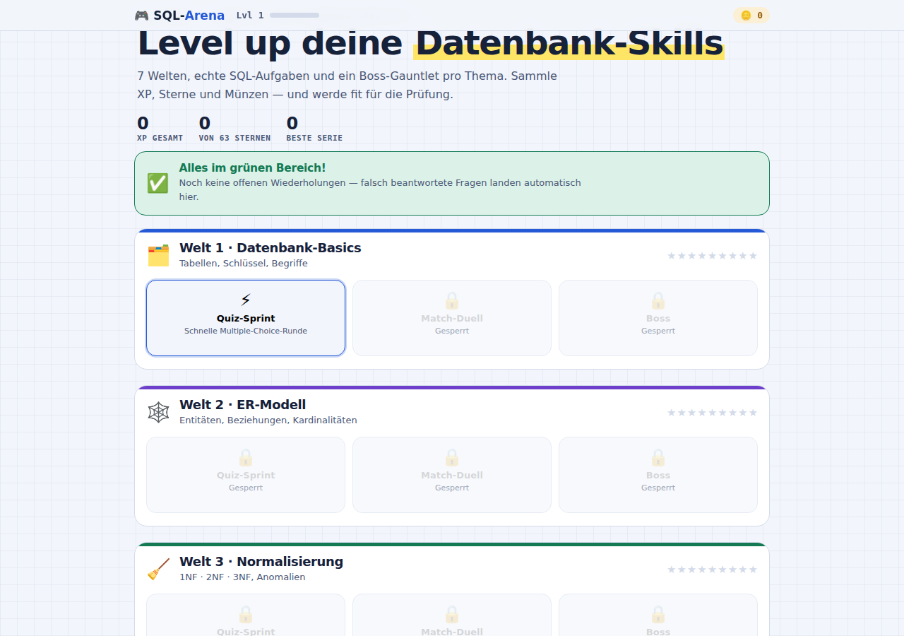
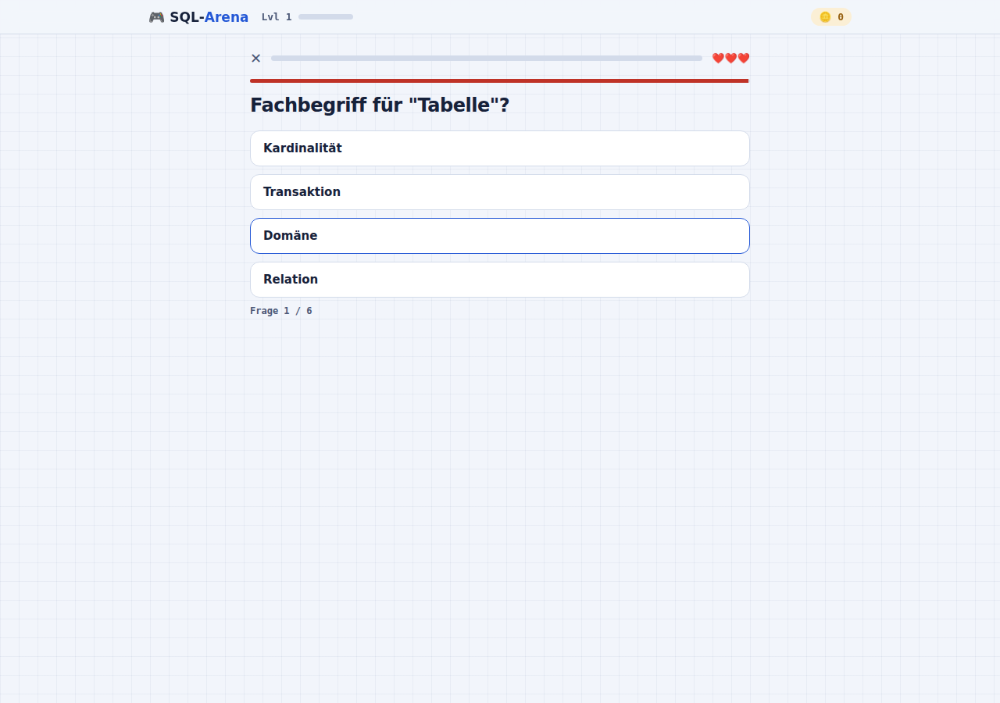
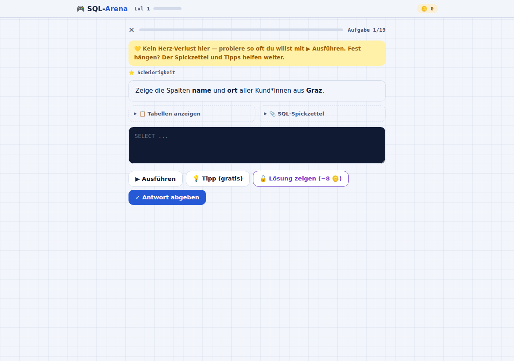
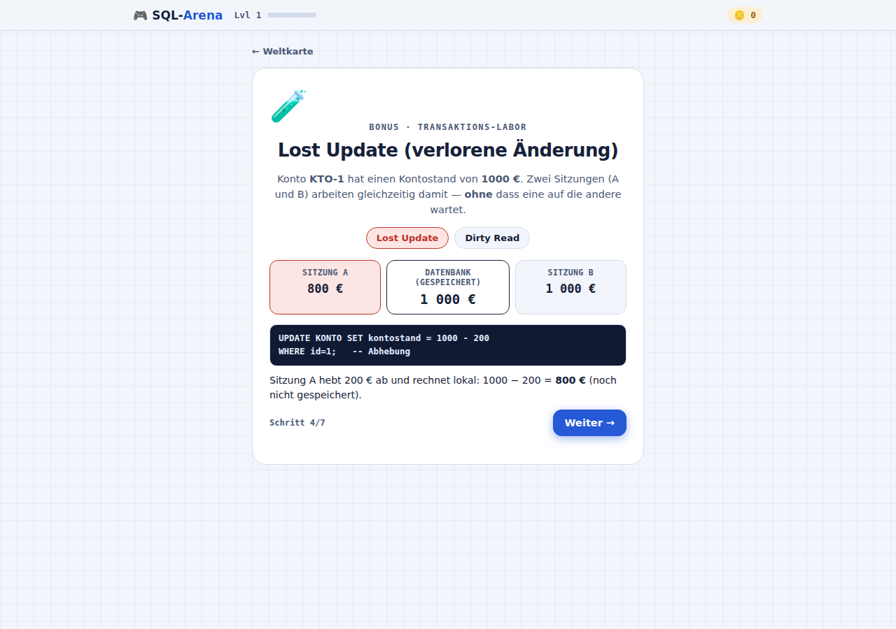

# 🎮 SQL-Arena

Ein interaktives Lernspiel für **Datenbanken & SQL** — leicht, motivierend und mit echten SQL-Abfragen, die live gegen eine kleine In-Memory-Datenbank laufen. Gebaut, um schnell prüfungsfit zu werden: 7 thematische Welten, ein Boss-Level pro Thema, eine eigene SQL-Werkstatt zum Ausprobieren ohne Druck, ein Bonus-Labor für Transaktionen und ein Wiederholungsmodus, der genau das übt, was noch nicht sitzt.

Läuft komplett offline im Browser — kein Server, keine Installation, keine Abhängigkeiten.



## Worum geht's?

SQL-Arena verwandelt den Stoff aus der Datenbank-Werkstatt (Tabellen, ER-Modell, Normalisierung, SQL-Abfragen, Transaktionen, NoSQL) in ein Spiel mit XP, Leveln, Münzen und Sternen. Jede der 7 Welten hat drei Stationen — ein schnelles Multiple-Choice-Quiz, eine Übungsstation (Begriffe zuordnen oder echtes SQL schreiben) und ein Boss-Level, das die Welt abschließt. Am Ende wartet eine gemischte Prüfungsarena mit Fragen aus allen Themen.

Alle SQL-Aufgaben laufen gegen eine **selbstgebaute SQL-Engine** (Tokenizer → Parser → Auswertung, reines JavaScript, kein sql.js/WASM nötig) und unterstützen mittlerweile auch fortgeschrittene Themen: JOINs (inkl. `NATURAL JOIN` / `USING`), Subqueries (`IN`, `EXISTS`, skalar, korreliert), `UNION`/`INTERSECT`/`EXCEPT`, `CREATE VIEW`, `ALTER TABLE` und `DROP TABLE`.

## Features

- **7 Lernwelten** — Datenbank-Basics, ER-Modell, Normalisierung, Tabellen & Vererbung, SQL-Abfragen, Transaktionen, NoSQL
- **Echte SQL-Werkstatt** — Abfragen werden live ausgeführt, mit Tabellen-Vorschau, direktem Fehler-Feedback, gratis erstem Tipp, kostenpflichtigen weiteren Tipps und einer optionalen Lösungsanzeige. Kein Herz-Verlust, kein Zeitdruck — beliebig oft ausprobieren
- **Immer sichtbarer SQL-Spickzettel** mit den wichtigsten Syntaxmustern
- **🧪 Transaktions-Labor (Bonus)** — Schritt-für-Schritt-Simulation von Lost Update und Dirty Read mit zwei parallelen Sitzungen, damit Nebenläufigkeitsprobleme nicht nur Theorie bleiben
- **🔁 Wiederholungsmodus** — merkt sich automatisch, welche Quiz-Fragen und SQL-Aufgaben falsch beantwortet wurden, und lässt gezielt genau die nochmal üben
- **🏆 Prüfungsarena** — gemischter, zeitbasierter Prüfungssimulator über alle Welten samt SQL-Aufgaben
- XP, Level, Münzen, Streak-Boni und Sterne-Bewertung pro Station — Fortschritt wird im Browser gespeichert (`localStorage`)

## Screenshots

| Weltkarte | Quiz-Sprint |
|---|---|
|  |  |

| SQL-Werkstatt | Transaktions-Labor |
|---|---|
|  |  |

## Spielen

Einfach `index.html` öffnen (lokal im Browser, oder über GitHub Pages, falls aktiviert). Der Fortschritt (XP, Sterne, Level, offene Wiederholungen) wird im `localStorage` des Browsers gespeichert.

## Entwickeln

Die eigentliche Quelle liegt in `src/*.js` / `src/*.css` / `src/*.html`. `build.sh` fügt alles zu der spielbaren `index.html` zusammen:

```
./build.sh
```

### Struktur

- `src/sqlengine.js` — eigene SQL-Engine (Tokenizer, Parser, Evaluator): SELECT/INSERT/UPDATE/DELETE/CREATE TABLE, JOIN/NATURAL JOIN/USING, UNION/INTERSECT/EXCEPT, Subqueries (IN/EXISTS/skalar, korreliert), CREATE VIEW, ALTER TABLE, DROP TABLE
- `src/data.js` — Seed-Datenbank, SQL-Aufgabenpool, Quiz-/Match-/Boss-Fragen aller Welten
- `src/engine.js` — Spiel-State, Persistenz, Weltkarte, Navigation, HUD, Wiederholungsmodus
- `src/stage_quiz.js` / `stage_match.js` / `stage_sql.js` / `stage_txlab.js` / `stage_exam.js` — die Spielmodi (Quiz/Boss, Match-Duell, SQL-Werkstatt, Transaktions-Labor, Prüfungsarena)
- `src/main.js` — Init

### Testen

```
node src/test_engine.js     # Unit-Tests der SQL-Engine
node src/test_content.js    # Validiert alle SQL-Aufgaben, Quiz-/Boss-/Match-Pools
```
